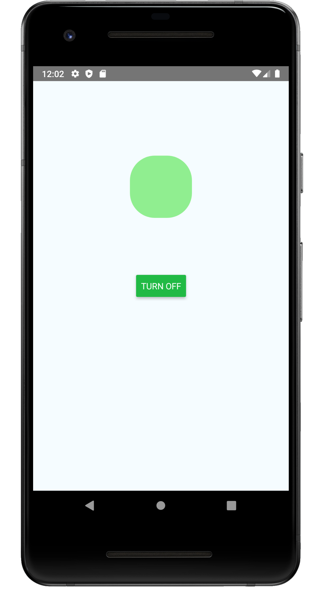

# Using WebSocket with React-Native

This [StackOverflow answer by qianlei](https://stackoverflow.com/a/45234513/4812090) where Razvan Alex
assked the question [Proper way of using WebSockets with React Native](https://stackoverflow.com/questions/44088058/proper-way-of-using-websockets-with-react-native).

## Created
```
(rn-py38) wink@wink-desktop:~/prgs/react-native (master)
$ npx react-native init Wss1 --template react-native-template-typescript
```

Then replaced the default `App.tsx` with the contents from [answer by qianlei](https://stackoverflow.com/a/45234513/4812090).

## Build and Run
In one terminal start the js-server
```
(rn-py38) wink@wink-desktop:~/prgs/react-native/Wss1
$ npx react-native start
┌──────────────────────────────────────────────────────────────────────────────┐
│                                                                              │
│  Running Metro Bundler on port 8081.                                         │
│                                                                              │
│  Keep Metro running while developing on any JS projects. Feel free to        │
│  close this tab and run your own Metro instance if you prefer.               │
│                                                                              │
│  https://github.com/facebook/react-native                                    │
│                                                                              │
└──────────────────────────────────────────────────────────────────────────────┘

Looking for JS files in
   /home/wink/prgs/react-native/Wss1 

Loading dependency graph, done.
```

In anther terminal run-android
```
(rn-py38) wink@wink-desktop:~/prgs/react-native/Wss1
$ npx react-native run-android
info Running jetifier to migrate libraries to AndroidX. You can disable it using "--no-jetifier" flag.
Jetifier found 864 file(s) to forward-jetify. Using 12 workers...
info JS server already running.
* daemon not running; starting now at tcp:5037
* daemon started successfully
info Launching emulator...
info Successfully launched emulator.
info Installing the app...
Starting a Gradle Daemon (subsequent builds will be faster)
/home/wink/.gradle/caches/modules-2/files-2.1/com.squareup.okhttp3/okhttp/3.12.1/dc6d02e4e68514eff5631963e28ca7742ac69efe/okhttp-3.12.1.jar: D8: Type `org.conscrypt.Conscrypt` was not found, it is required for default or static interface methods desugaring of `java.security.Provider okhttp3.internal.platform.ConscryptPlatform.getProvider()`

> Task :app:installDebug
11:06:41 V/ddms: execute: running am get-config
11:06:41 V/ddms: execute 'am get-config' on 'emulator-5554' : EOF hit. Read: -1
11:06:41 V/ddms: execute: returning
Installing APK 'app-debug.apk' on 'Pixel_2_API_28(AVD) - 9' for app:debug
11:06:41 D/app-debug.apk: Uploading app-debug.apk onto device 'emulator-5554'
11:06:41 D/Device: Uploading file onto device 'emulator-5554'
11:06:41 D/ddms: Reading file permision of /home/wink/prgs/react-native/Wss1/android/app/build/outputs/apk/debug/app-debug.apk as: rw-r--r--
11:06:42 V/ddms: execute: running pm install -r -t "/data/local/tmp/app-debug.apk"
11:06:42 V/ddms: execute 'pm install -r -t "/data/local/tmp/app-debug.apk"' on 'emulator-5554' : EOF hit. Read: -1
11:06:42 V/ddms: execute: returning
11:06:42 V/ddms: execute: running rm "/data/local/tmp/app-debug.apk"
11:06:42 V/ddms: execute 'rm "/data/local/tmp/app-debug.apk"' on 'emulator-5554' : EOF hit. Read: -1
11:06:42 V/ddms: execute: returning
Installed on 1 device.

Deprecated Gradle features were used in this build, making it incompatible with Gradle 6.0.
Use '--warning-mode all' to show the individual deprecation warnings.
See https://docs.gradle.org/5.5/userguide/command_line_interface.html#sec:command_line_warnings

BUILD SUCCESSFUL in 26s
27 actionable tasks: 27 executed
info Connecting to the development server...
info Starting the app on "emulator-5554"...
Starting: Intent { cmp=com.wss1/.MainActivity }
```

Shortly an emulator should appear with a red "LED" and a green "TURN ON" button:


If you press "TURN ON" button a "LOG It worked!" appears in the js-server terminal and the
"LED" toggles between red and green with each press:
```
 LOG  It worked!
 LOG  It worked!
 LOG  It worked!
 LOG  It worked!
 LOG  It worked!
 LOG  It worked!
```

